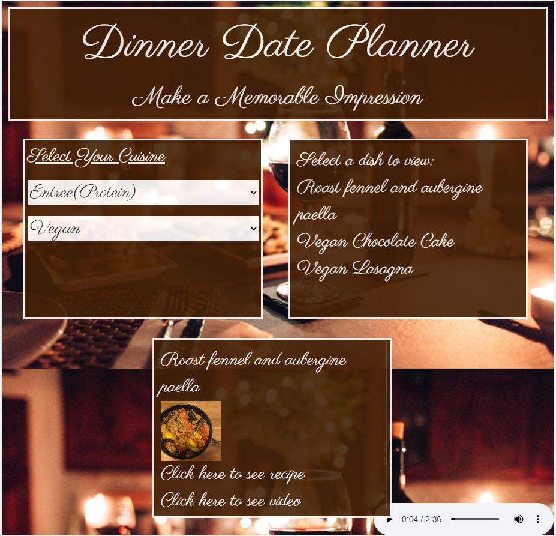

# Dinner Date Planner

# Description

We wanted to create an app that would provide those who want to plan a dinner date a quick way to search for a meal and a cocktail recipe based on their preferences. The Dinner Date Planner app provides the user the ability to search for meal and cocktail recipes and allows them to select the ones they want to use for a dinner date. User can view recipes and save their chosen selections so that they can go back and see what pairings they have used before.

# Usage
## Screenshot

# Credits

## Contributors

Jennifer Wariner - https://github.com/JenWariner19

Cesar Alonso Garcia - https://github.com/cesaralonsogarcia

Annalee Beltran - https://github.com/annaleebeltran

Daniel Sykes - https://github.com/Daniel-Sykes1

## APIs used:

The CocktailDB - https://www.thecocktaildb.com/api.php

The MealDB - https://www.themealdb.com/api.php

# Deployed Application

https://jenwariner19.github.io/dinner-date-planner/

# Languages Used

JavaScript, HTML, CSS, JQuery, Tailwind CSS

